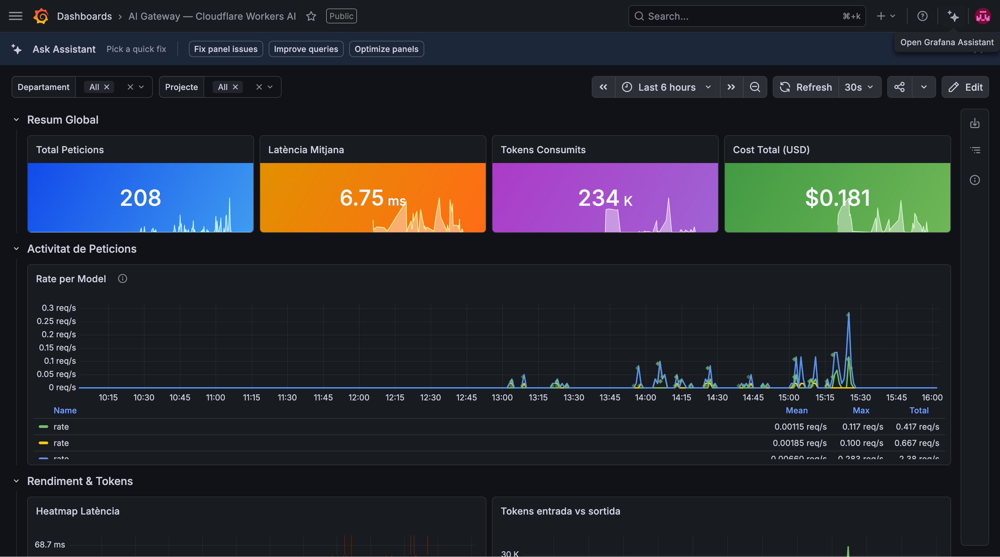

# GateWatch — AI Observability & Identity Gateway

GateWatch is a Cloudflare Worker that sits between every AI client and CF AI Gateway. It identifies who makes each request, enriches it with identity metadata, and lets CF AI Gateway handle DLP, model routing, and OTEL export to Grafana — transparently, in under 5ms.

```
AI Client → GateWatch Worker → CF AI Gateway → Workers AI (Kimi K2.6)
                                     ↓
                              OTEL spans → Grafana Cloud
```

---

## Prerequisites

- Cloudflare account with Workers and AI Gateway access
- [Wrangler CLI](https://developers.cloudflare.com/workers/wrangler/install-and-update/) installed
- Grafana Cloud account (free tier works)
- Node.js 18+

---

## Step 1 — Create the CF AI Gateway

1. Go to **Cloudflare Dashboard → AI → AI Gateway**
2. Click **Create Gateway**
3. Name it (e.g. `gatewatch`) and save
4. Copy the **Gateway URL** — format: `https://gateway.ai.cloudflare.com/v1/{account_id}/{gateway_id}`
5. Create a **CF API Token** with `AI Gateway: Edit` permission
   - Dashboard → My Profile → API Tokens → Create Token
   - Permission: `AI Gateway - Edit`
   - Save the token as `cfut_...`

---

## Step 2 — Deploy the GateWatch Worker

### Clone and configure

```sh
git clone https://github.com/mordonez/cloudflare-hackathon-2026-bcn.git
cd cloudflare-hackathon-2026-bcn
```

### Create the KV namespace

> **Demo only — KV as a temporary identity store.**
> For this demo, user identities and API keys are stored in Cloudflare KV.
> This is intentionally simple: KV works great for a hackathon but is **not** the
> recommended approach for production. In a real deployment, GateWatch should
> validate tokens against a corporate **Identity Provider (IdP)** — see the
> [Production identity backend](#production-identity-backend) section below.

```sh
wrangler kv namespace create IDENTITIES
# Copy the id from the output and update wrangler.toml:
# [[kv_namespaces]]
# binding = "IDENTITIES"
# id      = "<your-kv-id>"
```

### Set secrets

```sh
wrangler secret put GATEWAY_BASE_URL
# → https://gateway.ai.cloudflare.com/v1/{account_id}/{gateway_id}

wrangler secret put GATEWAY_AUTH_HEADER
# → Bearer cfut_...

wrangler secret put ADMIN_SECRET
# → any secret string (e.g. my-admin-secret-2026)
```

### Deploy

```sh
wrangler deploy
# → https://gatewatch-proxy.<subdomain>.workers.dev
```

### Verify

```sh
curl https://gatewatch-proxy.<subdomain>.workers.dev/gatewatch/health
# → {"status":"ok","worker":"gatewatch-proxy"}
```

---

## Step 3 — Configure DLP Firewall in CF AI Gateway

DLP rules block sensitive content before it reaches the model.

1. Go to **CF Dashboard → AI → AI Gateway → your gateway → Security**
2. Click **Add Rule**
3. Configure the rule:
   - **Name:** `acme_password_policy`
   - **Type:** Custom pattern
   - **Pattern (regex):** `acme_[a-zA-Z0-9]{4,}`
   - **Match on:** Request body
   - **Action:** Block
4. Save

Any request containing a token matching `acme_xxxx` is blocked with HTTP 400 and a span is exported to Grafana with `dlp_blocked = true`.

Add more rules as needed: PII (emails, credit cards), API secrets, GDPR-sensitive fields.

---

## Step 4 — Configure Dynamic Routes in CF AI Gateway

Dynamic Routes let you redirect requests to different models by department or project — no code changes, no redeploy.

1. Go to **CF Dashboard → AI → AI Gateway → your gateway → Dynamic Routes**
2. Click **Add Route**
3. Example routes:

| Route name | Condition | Target model |
|---|---|---|
| `legal-finance` | `cf-aig-metadata.departamento` = `legal` or `finance` | `@cf/moonshotai/kimi-k2.6` |
| `engineering` | `cf-aig-metadata.departamento` = `engineering` | `@cf/meta/llama-3.3-70b-instruct-fp8-fast` |
| `default` | — | `@cf/moonshotai/kimi-k2.6` |

GateWatch sends `cf-aig-metadata` with every request — the gateway reads those attributes to decide routing.

---

## Step 5 — Connect Grafana Cloud (OTEL)

CF AI Gateway exports OTEL spans natively. Connect it to Grafana Cloud Tempo.

### Get Grafana Cloud credentials

1. Go to [grafana.com](https://grafana.com) → your stack → **Connections → Add new connection**
2. Search for **OpenTelemetry**
3. Copy:
   - **OTLP endpoint:** `https://otlp-gateway-prod-{region}.grafana.net/otlp`
   - **Instance ID** and **API token** (create one with `MetricsPublisher` role)

### Configure CF AI Gateway to export to Grafana

1. Go to **CF Dashboard → AI → AI Gateway → your gateway → Observability**
2. Enable **OTEL export**
3. Set:
   - **Endpoint:** your Grafana OTLP URL
   - **Headers:** `Authorization: Basic base64({instanceId}:{apiToken})`
4. Save

From this point, every AI call generates a span in Grafana Tempo with these attributes:

```
cf.aig.metadata.usuario       = "maria@acme.com"
cf.aig.metadata.departamento  = "legal"
cf.aig.metadata.project       = "due-diligence"
cf.aig.metadata.env           = "production"
cf.aig.metadata.request_id    = "uuid"
cf.aig.model                  = "@cf/moonshotai/kimi-k2.6"
cf.aig.tokens.input           = 42
cf.aig.tokens.output          = 318
cf.aig.latency_ms             = 2840
```

---

## Step 6 — Create the Grafana Dashboard



1. Go to Grafana → **Dashboards → New → New Dashboard**
2. Add a **Tempo** datasource if not already connected
3. Suggested panels:

**Requests by department (bar chart)**
```
TraceQL: {span.cf.aig.metadata.departamento != ""} | count() by (span.cf.aig.metadata.departamento)
```

**Token usage by user (table)**
```
TraceQL: {} | sum(span.cf.aig.tokens.output) by (span.cf.aig.metadata.usuario)
```

**DLP blocked requests (stat)**
```
TraceQL: {span.cf.aig.dlp_blocked = "true"} | count()
```

**Latency by model (time series)**
```
TraceQL: {} | avg(duration) by (span.cf.aig.model)
```

4. Save the dashboard as **GateWatch Overview**

---

## Step 7 — Connect Claude to Grafana via MCP

The [Grafana MCP server](https://github.com/grafana/mcp-grafana) lets Claude query your Grafana instance directly — ask questions about your dashboards, explore traces, and get AI-powered analysis of your AI usage.

### Install the Grafana MCP server

```sh
npm install -g @grafana/mcp-server
# or use npx without installing
```

### Get a Grafana service account token

1. Grafana → **Administration → Service accounts → Add service account**
2. Role: **Viewer** (or Editor if you want Claude to create panels)
3. Add token → copy it

### Configure Claude Code

Add to your Claude Code MCP settings (`~/.claude/mcp_servers.json` or via `claude mcp add`):

```sh
claude mcp add grafana \
  --command npx \
  --args "-y" "@grafana/mcp-server" \
  --env GRAFANA_URL=https://your-org.grafana.net \
  --env GRAFANA_API_KEY=glsa_...
```

Or manually in `~/.claude.json`:

```json
{
  "mcpServers": {
    "grafana": {
      "command": "npx",
      "args": ["-y", "@grafana/mcp-server"],
      "env": {
        "GRAFANA_URL": "https://your-org.grafana.net",
        "GRAFANA_API_KEY": "glsa_xxxxxxxxxxxx"
      }
    }
  }
}
```

### Use Claude to query your data

Once connected, you can ask Claude things like:

```
"Which user consumed the most tokens today?"
"Show me all DLP-blocked requests from the engineering department"
"What's the average latency for Kimi K2.6 vs Llama 3.3 this week?"
"Create a Grafana panel showing cost per department over the last 7 days"
```

---

## Step 8 — Issue tokens and run the demo

### Issue a token for a user

```sh
# New user
curl -X POST https://gatewatch-proxy.<subdomain>.workers.dev/gatewatch/token \
  -H "x-admin-secret: <ADMIN_SECRET>" \
  -H "Content-Type: application/json" \
  -d '{
    "usuario":      "maria@acme.com",
    "departamento": "legal",
    "project":      "due-diligence",
    "client":       "webapp",
    "expires_in":   "8h"
  }'

# Existing user — reuses identity from KV, only email needed
curl -X POST https://gatewatch-proxy.<subdomain>.workers.dev/gatewatch/token \
  -H "x-admin-secret: <ADMIN_SECRET>" \
  -H "Content-Type: application/json" \
  -d '{"usuario": "maria@acme.com"}'
```

### Make an AI call

```sh
curl -X POST https://gatewatch-proxy.<subdomain>.workers.dev/workers-ai/v1/chat/completions \
  -H "Authorization: Bearer gw-<token>" \
  -H "Content-Type: application/json" \
  -d '{"model":"@cf/moonshotai/kimi-k2.6","messages":[{"role":"user","content":"Hello"}]}'
```

### Run the full demo

```sh
bash demo.sh
```

Registers 6 users across 5 departments, fires 15 AI calls in parallel, then sends 6 DLP-blocked prompts. All spans appear in Grafana with full identity attribution.

---

## Environment variables reference

| Variable | Type | Description |
|---|---|---|
| `GATEWAY_BASE_URL` | secret | CF AI Gateway endpoint |
| `GATEWAY_AUTH_HEADER` | secret | `Bearer <cf-api-token>` |
| `ADMIN_SECRET` | secret | Protects `/gatewatch/*` admin routes |
| `DEFAULT_ENV` | var | Default environment tag (`production`) |
| `WORKERS_HOSTNAME_MAP` | var | JSON map of hostname → metadata fields |

Model routing is configured in **CF AI Gateway → Dynamic Routes** (UI), not in the worker.

---

## Admin API reference

| Endpoint | Auth | Description |
|---|---|---|
| `GET /gatewatch/health` | — | Health check |
| `POST /gatewatch/token` | `x-admin-secret` | Issue or renew a user token |
| `GET /gatewatch/tokens` | `x-admin-secret` | List all active tokens |
| `DELETE /gatewatch/token/:key` | `x-admin-secret` | Revoke a token |

---

## Production identity backend

The KV token store used in this demo is intentionally minimal. For production, GateWatch should delegate identity resolution to a corporate IdP. The worker's `buildEnrichedMetadata()` function already has a layered resolution chain — you only need to replace or extend the KV lookup step.

### Recommended options

| Option | How it works | Best for |
|---|---|---|
| **Cloudflare Access (Zero Trust)** | CF Access sits in front of the worker and injects a signed JWT (`Cf-Access-Jwt-Assertion`). The worker validates it with the Access public key and reads `sub`, `email`, `groups` from the payload. | Companies already using Cloudflare Access / ZTNA |
| **OAuth 2.0 / OIDC (Okta, Entra ID, Auth0)** | The AI client obtains a short-lived access token from the IdP and sends it as `Authorization: Bearer <token>`. GateWatch calls the IdP's `/userinfo` or `/introspect` endpoint (cached in KV for TTL seconds) to resolve identity. | Standard enterprise SSO |
| **Workload identity (mTLS / service tokens)** | CF Access service tokens or mTLS client certificates identify machine-to-machine clients. The worker reads the `Cf-Access-Client-Id` header and maps it to a service identity stored in KV or a D1 database. | Internal services, CI/CD pipelines |
| **SCIM-provisioned KV** | Your IdP pushes user attributes to the worker via a SCIM endpoint. GateWatch stores them in KV and looks them up at request time — same flow as today but populated automatically from the directory instead of manually. | Orgs that already provision via SCIM |

### Example: Cloudflare Access JWT

Replace the KV lookup block in `buildEnrichedMetadata()` with:

```js
const accessJwt = request.headers.get('Cf-Access-Jwt-Assertion');
if (accessJwt) {
  const payload = decodeJWTPayload(accessJwt);
  // Optionally verify signature against https://<team>.cloudflareaccess.com/cdn-cgi/access/certs
  if (payload) {
    meta.usuario      = payload.email  || payload.sub || 'unknown';
    meta.departamento = payload.groups?.[0] || 'unknown'; // map groups → department
    inferenceMethod   = 'cloudflare_access';
  }
}
```

No KV needed — Access handles MFA, session expiry, and revocation. GateWatch just reads the verified JWT and forwards the enriched metadata to CF AI Gateway.
